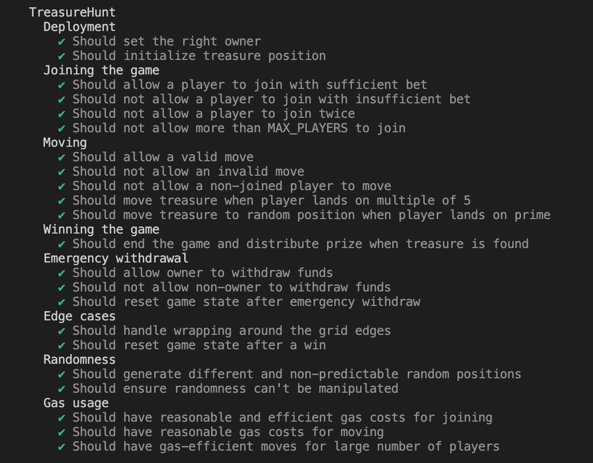
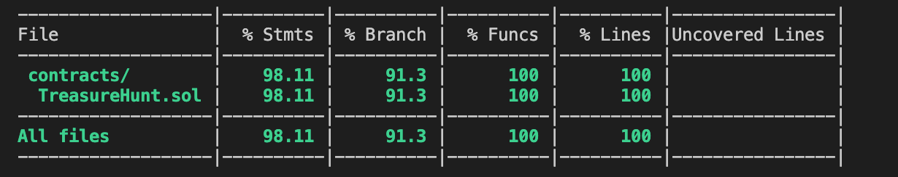
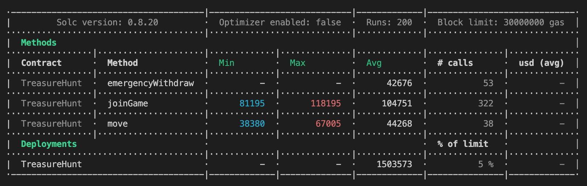

# TreasureHunt Smart Contract

TreasureHunt is an on-chain treasure hunt game implemented as a Solidity smart contract. Players can join the game by placing a bet and move around a virtual grid to find hidden treasure.

## Steps to run

### Prerequisites

- Node.js
- Yarn
- Hardhat

### Installation

1. Clone the repository:

   ```bash
   git clone https://github.com/Akkii4/TreasureHunt.git
   cd TreasureHunt
   ```

2. Install dependencies:

   ```bash
    yarn install
   ```

3. Compiling Smart Contract

   ```bash
    npx hardhat compile
   ```

4. Running test and gas coverage

   ```bash
    npx hardhat coverage
   ```

## Contract Functions

1. `joinGame()`: Allows a player to join the game by placing a bet.
2. `move(uint256 newPosition)`: Enables a player to move to a new position on the grid.
3. `getValidAdjacentPositions(uint256 currentPosition)`: Returns all valid adjacent positions for a given position.
4. `isValidMove(uint256 from, uint256 to)`: Checks if a move is valid.
5. `emergencyWithdraw()`: Allows the contract owner to withdraw all funds in case of emergency.

## Data Structures and Algorithms

1. **Mapping**: The contract uses a mapping to store player information, allowing for efficient lookup of player data.
2. **Array**: An array is used to keep track of player addresses, enabling iteration over all players.
3. **Struct**: A `Player` struct is used to store player information, including their position and game status.
4. **Random Number Generation**: The contract implements a custom pseudo-random number generator for determining treasure and player positions.
5. **Prime Number Check**: A simple primality test is implemented to determine when to move the treasure randomly.

## Design Choices

1. **Grid-based Movement**: The game uses a 10x10 grid (100 total positions) for player movement, allowing for simple and intuitive gameplay.
2. **Treasure Movement**: The treasure moves based on player actions, adding dynamism to the game:
   - If a player lands on a multiple of 5, the treasure moves to a random adjacent position.
   - If a player lands on a prime number, the treasure moves to a completely random position.
3. **Winning Mechanism**: The game ends when a player lands on the same position as the treasure, with the winner receiving 90% of the contract balance.
4. **Security Measures**:
   - The contract inherits from OpenZeppelin's `Ownable` and `ReentrancyGuard` to prevent common vulnerabilities.
   - Custom modifiers and error handling are implemented to ensure proper access control and input validation.

## Randomness Implementation

The contract uses a pseudo-random number generation (PRNG) method for determining positions:

```solidity
function getRandomPosition() private returns (uint8) {
    return uint8(
        uint256(
            keccak256(
                abi.encodePacked(
                    block.number,
                    block.timestamp,
                    msg.sender,
                    nonce++
                )
            )
        ) % TOTAL_POSITIONS
    );
}
```

This method combines several sources of entropy:

- `block.number`: The current block number
- `block.timestamp`: The current block timestamp
- `msg.sender`: The address of the function caller
- `nonce`: An incrementing counter to ensure uniqueness

### Shortcomings of Current PRNG

1. **Predictability**: Miners can potentially influence `block.number` and `block.timestamp`, making the randomness partially predictable.
2. **Limited Entropy**: The sources of randomness are limited and can be manipulated or predicted to some extent.
3. **Lack of True Randomness**: This method generates pseudo-random numbers, not cryptographically secure random numbers.

### Improving Randomness with Chainlink VRF

To address these shortcomings, we can use Chainlink's Verifiable Random Function (VRF) oracle:

1. **True Randomness**: Chainlink VRF provides cryptographically secure random numbers.
2. **Verifiability**: The randomness can be verified on-chain, ensuring fairness.
3. **Resistance to Manipulation**: External randomness source prevents miner or user manipulation.

To implement Chainlink VRF:

1. Import the required Chainlink contracts.
2. Implement the `VRFConsumerBase` contract.
3. Replace the `getRandomPosition()` function with a request to Chainlink VRF.
4. Implement a callback function to receive and process the random number.

Example implementation:

```solidity
import "@chainlink/contracts/src/v0.8/VRFConsumerBase.sol";

contract TreasureHunt is Ownable, ReentrancyGuard, VRFConsumerBase {
    bytes32 internal keyHash;
    uint256 internal fee;

    constructor() VRFConsumerBase(
        0x2Ca8E0C643bDe4C2E08ab1fA0da3401AdAD7734D, // VRF Coordinator
        0x326C977E6efc84E512bB9C30f76E30c160eD06FB  // LINK Token
    ) {
        keyHash = 0x79d3d8832d904592c0bf9818b621522c988bb8b0c05cdc3b15aea1b6e8db0c15;
        fee = 0.1 * 10 ** 18; // 0.1 LINK
    }

    function getRandomPosition() internal returns (bytes32 requestId) {
        require(LINK.balanceOf(address(this)) >= fee, "Not enough LINK");
        return requestRandomness(keyHash, fee);
    }

    function fulfillRandomness(bytes32 requestId, uint256 randomness) internal override {
        uint8 newPosition = uint8(randomness % TOTAL_POSITIONS);
        // Use newPosition to update game state
    }
}
```

By implementing Chainlink VRF, we significantly improve the security and fairness of the TreasureHunt game, making it resistant to manipulation and providing true randomness for critical game mechanics.

## Testing Approach

The tests are written using Chai and Hardhat, covering:

1. Deployment
2. Joining the game
3. Moving
4. Winning the game
5. Emergency withdrawal
6. Randomness
7. Gas usage
8. Error cases and edge conditions

The tests ensure that all main functionalities work as expected and that proper access control is maintained throughout the contract's operations.

## Testing Report

### TestResult



### TestCoverageResult



### GasReport


